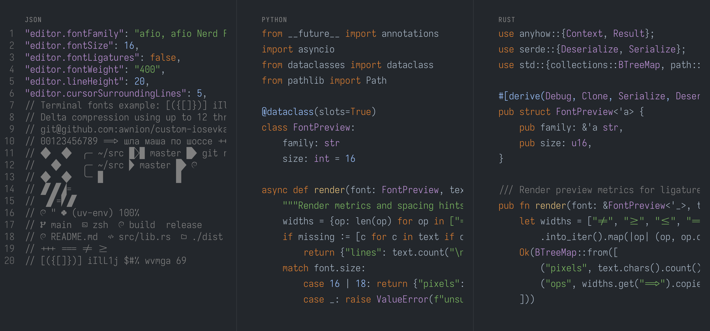
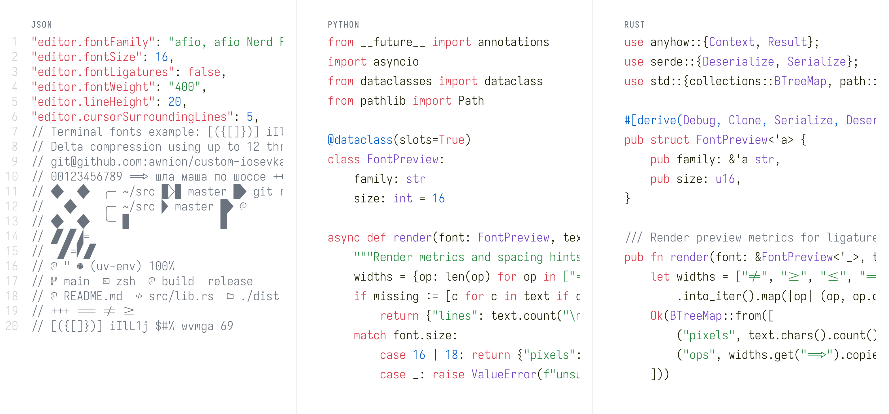
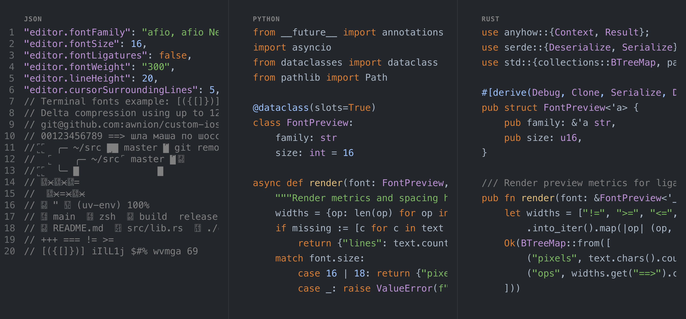
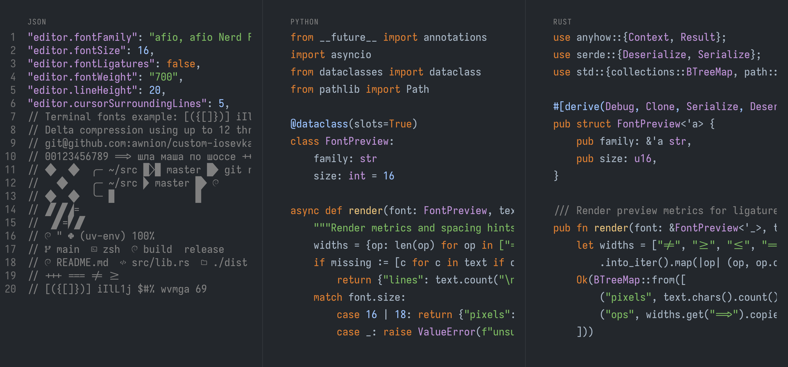
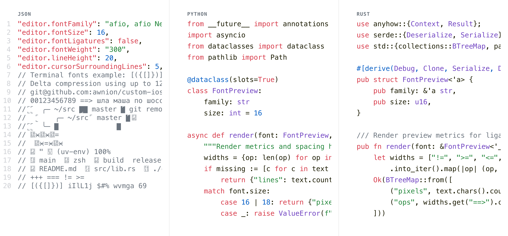
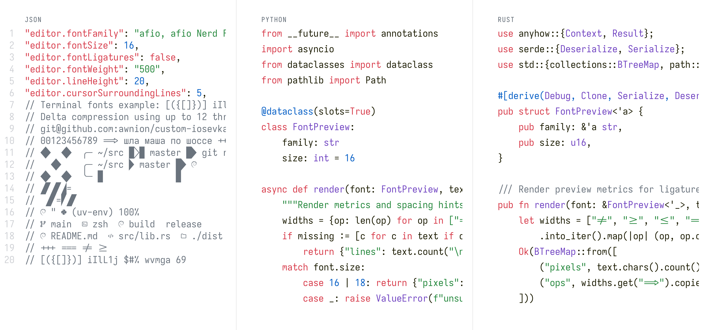
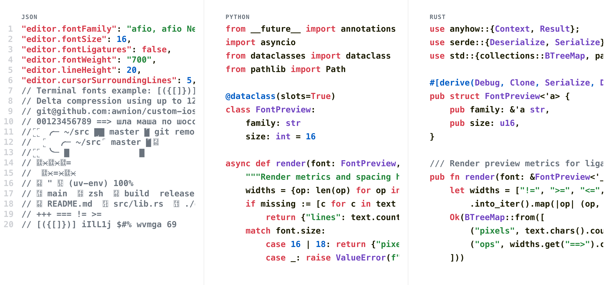

# AFIO - Custom Iosevka Nerd Font (more examples in the end)

<p float="left">
  
  
</p>

## Why AFIO?

[Iosevka](https://typeof.net/Iosevka/) is one of the most customizable coding fonts out there — hundreds of glyph variants, adjustable spacing, weight, and width. **BUT** if you want Nerd Font icons (powerline symbols, devicons, file icons), you're stuck with the [prebuilt versions](https://github.com/ryanoasis/nerd-fonts) that ship a few default configurations. No custom glyphs, no weight tuning, no width control — take it or leave it.

## AFIO is two things in one

1. **Ready-to-use font** which I use myself. Just grab AFIO from [releases](https://github.com/awnion/custom-iosevka-nerd-font/releases) and install. Hand-picked glyph variants, carefully tuned weights, 9000+ Nerd Font icons — all done for you.

2. **Build-your-own Nerd Font Iosevka template**:
    - fork this repo
    - edit `private-build-plans.toml` to your taste
    - push 🚀
    - GitHub Actions will build your custom Iosevka + Nerd Font automatically
    - No local setup needed 🤷

## AFIO Key modifications (very opinionated)

- Custom glyph variants: `f` (flat-hook-serifless), `i` (serifed-asymmetric), `l` (serifed-semi-tailed), `m` (short-leg), `0` (dotted), `9` (open-contour), `*` (hex-low), `%` (dots), `@` (fourfold-solid-inner-tall), tittle (square)
- Font weights: 300 (light), 400 (regular), 500 (medium), 700 (bold)
- Bold shape weight is 500 (lighter than default bold)
- No italic and oblique versions
- Term spacing, sans serifs
- Glyph shape width: 540

## Build it yourself with Docker

```bash
./build.sh
```

Fonts will be in `_output` dir.

### vscode settings.json

```jsonc
...
"editor.fontFamily": "afio",
"editor.fontLigatures": false,
"editor.fontWeight": "500",
"editor.fontSize": 16,
"editor.lineHeight": 21,
...
```

## Links

- Iosevka webpage <https://typeof.net/Iosevka/>
- Build Iosevka font using docker <https://github.com/ejuarezg/containers/tree/master/iosevka_font#container-method>
- Nerd Font patcher <https://github.com/ryanoasis/nerd-fonts>

## License

This project is dual-licensed under either:

- MIT License ([LICENSE-MIT](LICENSE-MIT) or <http://opensource.org/licenses/MIT>)
- Apache License, Version 2.0 ([LICENSE-APACHE](LICENSE-APACHE) or <http://www.apache.org/licenses/LICENSE-2.0>)

at your option.

### Contribution

Unless you explicitly state otherwise, any contribution intentionally submitted for inclusion in this project by you, as defined in the Apache-2.0 license, shall be dual licensed as above, without any additional terms or conditions.

## Download

Check [releases](https://github.com/awnion/custom-iosevka-nerd-font/releases) page

## TODO

- [ ] Windows friendly fontfamily name (might be already good, just need to test it)

## Examples

### Dark theme showcase

#### 300



#### 400


#### 500


#### 700



### Light theme showcase

#### 300



#### 400


#### 500



#### 700


