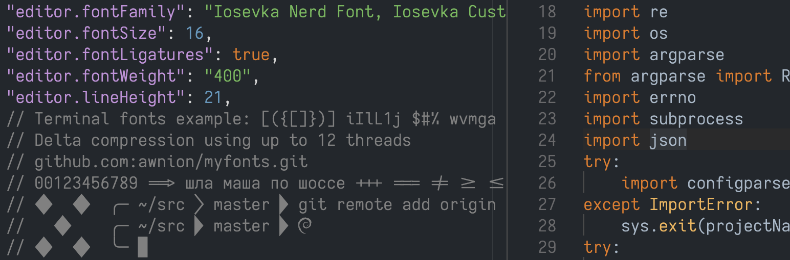
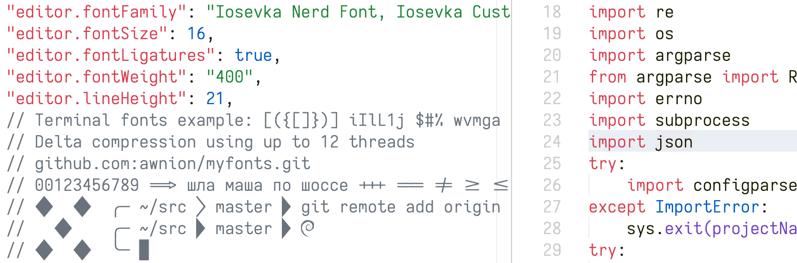

# Custom Iosevka Nerd Font

## Get
| Dark | Light |
|-|-|
|  |  |

## Motivation

* Iosevka has a lot of modificaions, but Nerd Font repo has only a few of them
* don't need italic and oblique versions (so can speed up compilation)
* need only specific font weights (e.g. 200 300 400 500)
* need to fake bold weight to 500
* need specific base font width
* need nerd font version
* need oneliner to build everything :)

## Key modifications

* Changed `m i l % 0` and others
* Changed font weights (e.g. "bold" has weight 500)
* No italic and oblique versions by default (can be included optionally)
* Base font shape width is `6`

For more options edit: `private-build-plans.toml` and build

## Build it yourself with Docker

```
./build.sh
```

Fonts will be in `_output` dir.

vscode settings.json
```
...
"editor.fontFamily": "Iosevka Nerd Font, Iosevka Custom",
"editor.fontWeight": "400",
"editor.fontSize": 16,
"editor.lineHeight": 21,
...
```

## Links

* Iosevka webpage https://typeof.net/Iosevka/
* Build Iosevka font using docker https://github.com/ejuarezg/containers/tree/master/iosevka_font#container-method
* Nerd Font patcher https://github.com/ryanoasis/nerd-fonts
